# MemoryOS — AI Agent with Persistent Memory & Tool Use


A production-grade AI agent that remembers users across sessions and autonomously completes multi-step tasks using real tools — web search, code execution, Google Calendar, and file I/O.

---

## The problem

Most AI assistants are stateless — every conversation starts from scratch. Enterprise agents face a compounding version of this: no memory of past decisions, single-purpose tools, no self-correction, and no way to measure reliability. MemoryOS solves all four.

---

## How it works




**Three-layer memory stack:**
- `mem0` — long-term facts persisted across sessions
- In-memory dict — short-term session context
- Episodic log — past task history

---

## Features

- **Persistent memory** — agent recalls user context across conversations using mem0
- **Multi-tool execution** — Tavily web search, E2B sandboxed code execution, Google Calendar, File I/O (read/write/list)
- **Self-correction loop** — Critic node reviews every step and triggers retries on failure
- **Production eval suite** — DeepEval benchmarks measuring faithfulness, hallucination, and answer relevancy
- **Chainlit UI** — clean chat interface with plan visibility and streaming responses

---

## Tech stack

| Component | Technology |
|---|---|
| Agent framework | LangGraph |
| LLM | GPT-4o |
| Long-term memory | mem0 |
| Web search | Tavily API |
| Code execution | E2B sandbox |
| Calendar | Google Calendar API |
| File I/O | Python built-in (read/write/list) |
| Frontend | Chainlit |
| Evals | DeepEval |

---

## Evaluation results

Benchmarked using DeepEval on 5 test cases:

| Metric | Score | Threshold | Status |
|---|---|---|---|
| Answer Relevancy | 0.86 | 0.70 | ✅ PASSED |
| Faithfulness | 1.00 | 0.70 | ✅ PASSED |
| Hallucination | 0.00 | 0.30 | ✅ PASSED |
| Web search functional | — | functional | ✅ PASSED |
| Code execution (sum 1–10) | — | output = 55 | ✅ PASSED |

**Pass rate: 100% (5/5) | Token cost per run: ~$0.06**

---

## Project structure

```
memory-agent/
├── agents/
│   ├── planner.py        # Breaks tasks into steps, loads memory
│   ├── executor.py       # Runs tools based on task type
│   └── critic.py         # Reviews output, triggers self-correction
├── graph/
│   └── workflow.py       # LangGraph StateGraph definition
├── memory/
│   ├── long_term.py      # mem0 cross-session memory
│   └── session.py        # Short-term session context
├── tools/
│   ├── search.py         # Tavily web search
│   ├── code_exec.py      # E2B sandboxed code execution
│   ├── calendar.py       # Google Calendar read/create/invite
│   └── file_io.py        # Read, write, list local files
├── evals/
│   ├── test_agent.py     # DeepEval test suite
│   └── conftest.py
├── ui/
│   └── app.py            # Chainlit frontend
├── core/
│   ├── config.py         # Environment config
│   └── state.py          # LangGraph AgentState schema
├── .env.example
└── requirements.txt
```

---

## Setup

### 1. Clone and install

```bash
git clone https://github.com/pranavpawar2103/memory-agent.git
cd memory-agent
python -m venv venv
venv\Scripts\activate       # Windows
pip install -r requirements.txt
```

### 2. Configure environment

```bash
cp .env.example .env
```

Add your keys to `.env`:

```
OPENAI_API_KEY=sk-your-key
TAVILY_API_KEY=tvly-your-key
E2B_API_KEY=e2b-your-key
MEM0_API_KEY=your-mem0-key
```

### 3. Google Calendar setup

- Download `credentials.json` from Google Cloud Console (OAuth 2.0 Desktop App)
- Place it in the project root
- On first run, a browser will open for authorization — `token.json` is saved automatically

### 4. Run

```bash
chainlit run ui/app.py
```

Open `http://localhost:8000` and start chatting.

### 5. Run evals

```bash
deepeval test run evals/test_agent.py
```

---

## Example usage

```
User: Search the web for the top 3 AI trends in 2025

Agent Plan:
1. Conduct a web search for AI trend predictions
2. Identify the most frequently mentioned trends
3. Summarize the top 3 trends

[SEARCH] → Tavily results from Deloitte, MIT, IBM
[LLM]    → Synthesized summary
```

```
User: Schedule a meeting called MemoryOS Demo on 2026-04-01 at 14:00 and invite john@example.com

Agent Plan:
1. Create calendar event
2. Send invite to attendee

[CALENDAR] → Event created + invite sent ✓
```

```
User: Write a file called notes.txt with the content: MemoryOS project notes. Then read it back.

Agent Plan:
1. Write the content to notes.txt
2. Read the content from notes.txt

[FILE] WRITE:notes.txt|MemoryOS project notes → File written successfully
[FILE] READ:notes.txt → MemoryOS project notes ✓
```

---

## API keys

| Service | Free tier | Link |
|---|---|---|
| OpenAI | Pay per use | https://platform.openai.com/api-keys |
| Tavily | 1,000 searches/month free | https://app.tavily.com |
| E2B | 100 sandbox hours/month free | https://e2b.dev |
| mem0 | Free tier available | https://app.mem0.ai |

---

## Industry applications

- **Enterprise knowledge** — persistent employee assistant that remembers decisions and project context
- **Healthcare** — clinical assistant retaining patient history across sessions
- **Dev tooling** — coding agent that remembers project conventions and runs code end-to-end
- **Sales / CRM** — recalls every prospect interaction and drafts follow-ups autonomously

---

## Author

**Pranav Pawar** — Master's in Computer Science, University of Ottawa

- LinkedIn: [linkedin.com/in/pranav-pawar](https://www.linkedin.com/in/pranav-pawar-4175741b3/)
- Email: ppawa018@uottawa.ca
- GitHub: [github.com/pranavpawar2103](https://github.com/pranavpawar2103)

---

## License

MIT